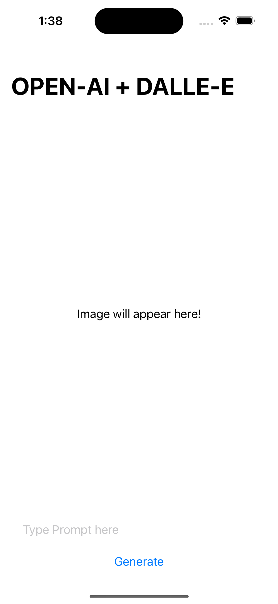
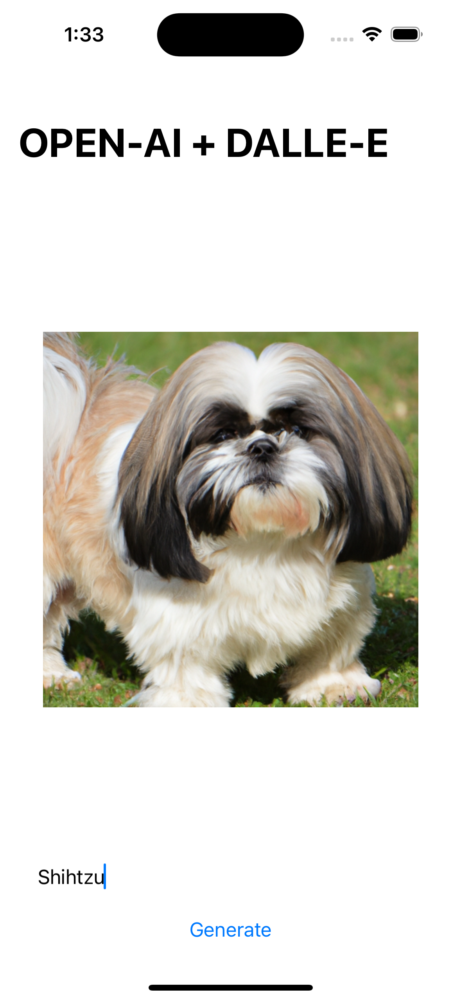
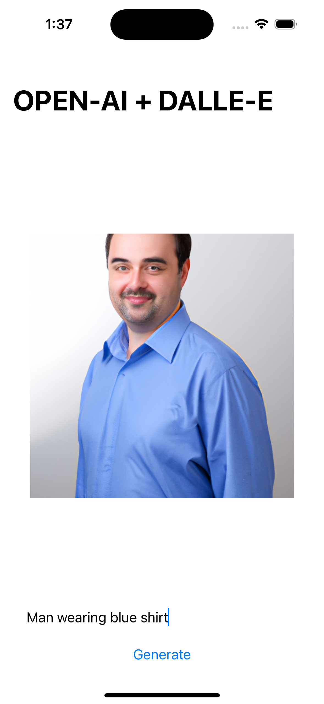
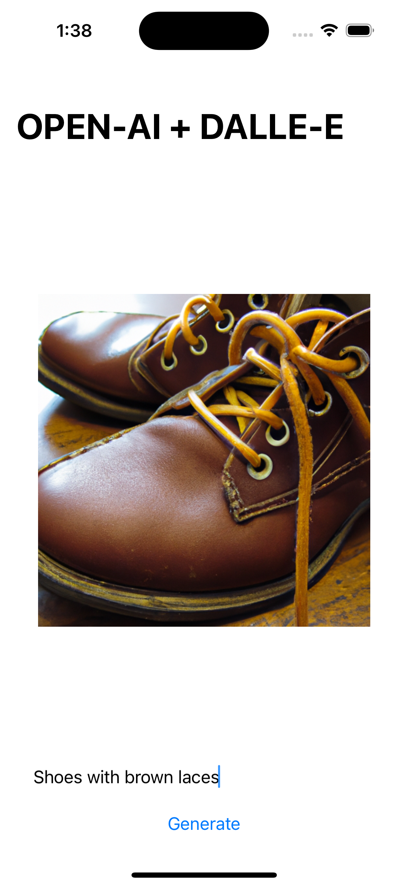

# OpenAI-Image-Generator
Made an IOS Application using Swift and OpenAI API package that allows you to enter any prompt and it will generate the result of it in image format.

## Screenshots
https://user-images.githubusercontent.com/86314754/207816607-1309384f-a021-4f42-a985-dc0accb0e409.mp4

     
